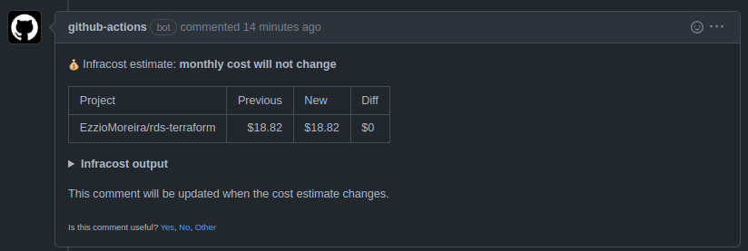

# Infracost
O Infracost mostra as estimativas de custo dos recursos que serão provisionados via Terraform. Ele permite que DevOps, SRE e engenheiros vejam com detalhamento os custos estimado dos recursos antes de serem implantados na infraestrutura.

## Inputs
| Nome | Descrição | Requirida | Default |
|------|-----------|-----------|---------|
| `OS_VERSION` | Versão do sistema operacional | não | ubuntu-latest |
| `TF_DIRECTORY` | Diretório do projeto terraform | não | . |

## Secrets

| Nome | Descrição | Requerida | Default |
|------|-----------|-----------|---------|
| `INFRACOST_API_KEY` | As credenciais da API do Infracost | Sim | N/A |

> Para criar APIKEY do Infracost siga os passos da documentação oficial: [Criar APIKEY Infracost](https://www.infracost.io/docs/infracost_cloud/authentication/)

## Utilizando 
Criar a seguintes estrutura de diretórios: 

`.github/workflows/<proposito>.yml`

Utilize o exemplo abaixo para seu pipeline de CI:

```yaml
name: "Estimativa de custo da infra com Infracost"

on: 
  pull_request:
  
jobs:
  infracost:
    uses: "mentoriaiac/cicd_centralizado/.github/workflows/infracost.yaml@v1"
    secrets:
      INFRACOST_API_KEY: ${{ secrets.INFRACOST_API_KEY }}
```

## Resultado
A saída esperada após abertura de PR será: 


